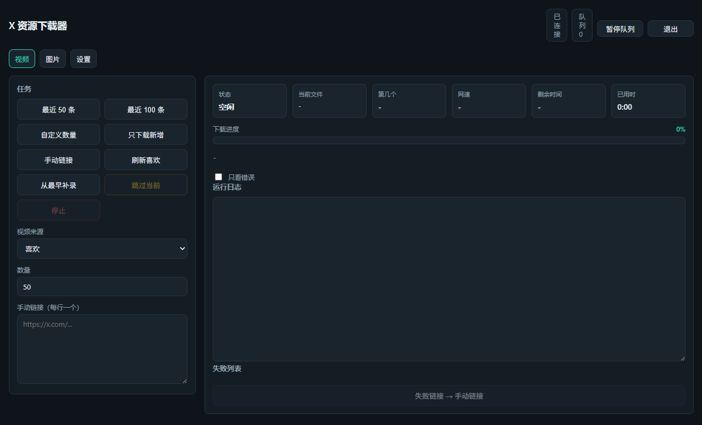
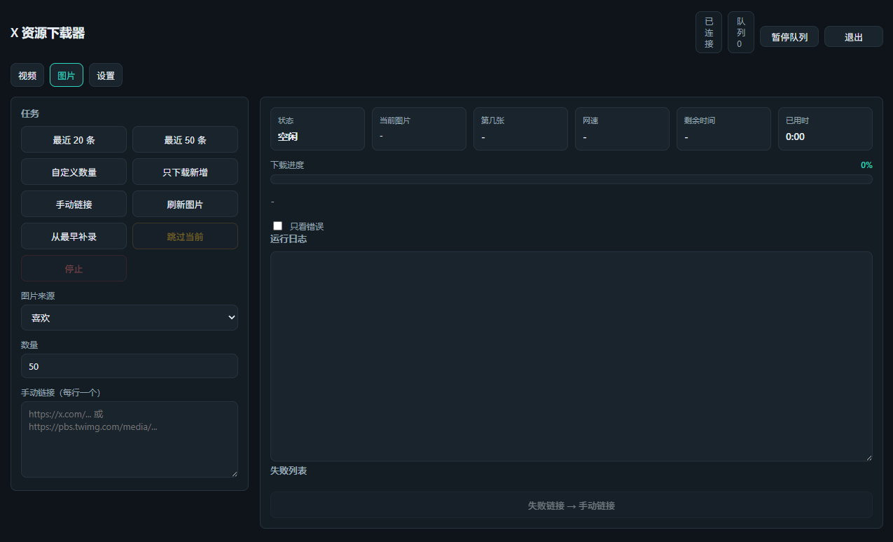

# X 资源下载器

自动从你的 X 账号采集喜欢、书签、搜索、回复、关注列表等来源的视频与图片，并以原画/最高码率增量下载到本地。

## 核心功能

- **视频下载**：自动采集 X 喜欢/书签/搜索结果/我的回复/关注列表/自定义列表，使用 `yt-dlp` 下载最高码率直链 MP4。
- **图片下载**：从同样来源采集图片，使用 `pbs.twimg.com` 的 `name=orig` 原画地址，支持 Python、curl、浏览器同源 fetch 三通道。
- **增量去重**：`archive.txt`、`image_archive.txt`、`seen_urls.txt`、`video_meta.txt` 配合，已下载内容不会重复下载。
- **双账号隔离**：主账号采集，独立小号下载，支持多小号账号池轮换。
- **批量任务队列**：多任务排队、暂停/恢复、任务持久化到 `data/jobs/`，重启后可继续。
- **失败重试可视化**：网络瞬断自动重试，失败列表显示重试次数、原因分类与缩略图。
- **更多来源**：喜欢、书签、搜索、我的回复、关注列表、自定义列表。
- **导出与去重**：一键生成 JSON/CSV 索引，支持按文件哈希本地去重（移动或硬链接）。
- **定时任务**：按小时/分钟自动入队执行。
- **发行版开箱即用**：release 内置 Node、yt-dlp、Playwright 与 ffmpeg，无需安装依赖。

## 关于本项目

这是一个个人工具项目，开发过程中借助 AI 提升了编码效率，核心逻辑、交互设计与测试均由人工完成。欢迎提交 Issue 和 PR 一起改进。

## 前置要求

- **Windows 10/11**，已安装 **Chrome**（程序会复用系统 Chrome）。
- 使用源码运行：需要 **Python 3** 与 **Node.js 18+**，并加入 PATH。
- 使用 release 发行版：不需要安装 Python/Node，双击启动程序即可。
- 首次使用需要 X 账号登录。

## 快速开始

### 普通用户（release 版）

1. 解压 `release\X资源下载器.zip`。
2. 双击 `启动X资源下载器.bat` 打开 GUI。
3. 首次启动会显示向导：登录主账号 → 登录小号（可选）→ 选择下载目录 → 完成。
4. 在“视频”或“图片”板块选择来源与数量，点击对应任务按钮。

如遇启动问题，检查 `program\gui_error.log`。

### 源码运行

1. 安装依赖：

```powershell
.\setup.ps1
```

2. 启动 GUI：

```powershell
.\start_gui.ps1
```

3. 或使用命令行入口：

```powershell
.\run_all.ps1
```

## GUI 使用指南

GUI 顶部有三个板块：**视频 / 图片 / 设置**。

### 视频板块

任务按钮：

- **最近 50 条 / 最近 100 条**：采集并下载最新 N 条视频。
- **自定义数量**：按输入数量采集。
- **只下载新增**：扫描来源并下载尚未下载的视频，遇到第一条已下载视频且已找到新视频时停止。
- **手动链接**：把失败链接或自定义推文链接填入左侧输入框后下载。
- **刷新喜欢**：快速采集最新约 20 条并下载新增。
- **从最早补录**：以 `archive.txt` 中最早一条已下载视频为锚点，向更早内容补录指定数量，支持续扫。
- **跳过当前**：终止当前视频下载并写入跳过列表，继续处理剩余任务。
- **停止**：停止当前任务。

状态面板实时显示：状态、当前文件、第几个/总数、网速、剩余时间、已用时、进度条。

日志支持“只看错误”过滤；失败列表可一键填入手动链接。



### 图片板块

任务按钮与视频板块对齐：最近 20 条、最近 50 条、自定义数量、只下载新增、刷新图片、从最早补录、手动链接、跳过当前、停止。

- 图片来源：喜欢 / 书签 / 搜索结果 / 我的回复 / 关注列表 / 自定义列表。
- 搜索和自定义列表会显示对应的关键词或链接输入框。
- 图片保存到 `data/images/<来源>/`，默认原画。
- 图片失败列表显示缩略图。



### 设置板块

**视频设置**

- 文件夹结构：全部放在视频目录 / 按发布者 / 按月份 / 发布者 + 月份。
- 命名格式：`日期-发布者-ID`，或追加最多 40 字符短标题。
- 下载位置：可手动输入或点击“选择”使用系统文件夹对话框。

**图片设置**

- 文件夹结构：全部放在图片目录 / 按发布者 / 按月份 / 发布者 + 月份。
- 命名格式：媒体 ID，或媒体 ID-推文 ID。
- 下载位置：支持“选择”按钮。

**通用设置**

- 代理：自动 / 关闭 / 自定义地址。
- 下载限速：如 `5M`，对应 `yt-dlp --limit-rate`。
- 分来源代理：按行配置 `来源=代理`，例如 `video_likes=http://127.0.0.1:7890`。
- 强制重新下载已下载过的视频。
- 独立下载账号（小号）与多小号账号池。
- 本地去重策略：移动到 `data/duplicates` 或硬链接。
- 生成 JSON/CSV 索引、本地去重扫描、定时任务管理、任务历史。

## 高级用法

### 双账号模式

主账号使用 `data/profiles/main/` 采集，下载小号使用独立配置。

GUI 设置里：

1. 勾选“使用独立下载账号（小号）”。
2. 点击“更换/登录小号”。
3. 可选填写“小号名称”以加入账号池，例如 `acc1`，生成：
   - `data/profiles/download_acc1/`
   - `data/cookies/cookies_download_acc1.txt`

下载时自动轮换账号池中的小号 Cookie；小号不存在时回退主账号 Cookie。

命令行登录小号：

```powershell
.\login_download.ps1
```

### 手动下载链接

视频手动链接支持推文链接；图片手动链接支持推文链接与 `pbs.twimg.com/media/...` 直链。

命令行方式：

```powershell
.\manual_download.ps1
```

### 单独脚本

只采集：

```powershell
.\collect_likes.ps1
```

只下载已有列表：

```powershell
.\download_videos.ps1
```

重建视频 URL-媒体映射（从日志）：

```powershell
node rebuild_video_meta.js config.json
```

持续补全映射（夜间运行，随机间隔）：

```powershell
.\run_map.ps1
```

等价于直接运行：

```powershell
node map_remaining_video_meta.js config.json
```

环境变量：

- `MIN_DELAY` / `MAX_DELAY`：随机间隔毫秒。
- `MAX_URLS`：单次最多检查条数（默认无限）。
- `MAX_RETRIES`：单条失败重试上限（默认 3）。

生成索引：

```powershell
node export_index.js config.json
```

本地去重：

```powershell
$env:DEDUP_STRATEGY='move'
node dedup_local.js config.json
```

策略：`move`（移动到 `data/duplicates`）或 `hardlink`（硬链接）。

### 命令行菜单

双击 `menu.bat` 或运行：

```powershell
.\menu.ps1
```

菜单选项：

```text
1. 采集最近 50 条喜欢视频并下载
2. 采集最近 100 条喜欢视频并下载
3. 自定义采集数量
4. 只下载新增（扫描喜欢列表并下载新的）
5. 手动粘贴链接下载
0. 退出
```

### 定时任务

Windows 计划任务（每周日 03:00）：

```powershell
.\install_scheduler.ps1
```

改为每天：

```powershell
.\install_scheduler.ps1 -Frequency daily
```

删除：

```powershell
Unregister-ScheduledTask -TaskName 'X Liked Videos Download' -Confirm:$false
```

GUI 内定时任务：在“设置 → 定时任务”添加模式、数量、来源、小时、分钟，服务端每分钟检查并自动入队。

## 目录结构

```text
根目录
├─ 源码与启动脚本
├─ config.json / settings.json
├─ release/               可分发发行版
├─ data/
│  ├─ videos/              视频（likes / bookmarks / manual）
│  ├─ images/              图片（likes / bookmarks / manual）
│  ├─ logs/                运行日志
│  ├─ lists/               下载记录、采集列表、失败记录、映射等
│  ├─ profiles/            主账号与小号浏览器配置
│  ├─ cookies/             Cookie 文件
│  ├─ jobs/                任务持久化记录
│  ├─ duplicates/          去重移动目录
│  ├─ index.json           导出索引
│  └─ index.csv            导出索引
└─ .venv/                  源码运行虚拟环境
```

`data/lists/` 内文件：

- `archive.txt`：已下载视频媒体 ID。
- `image_archive.txt`：已下载图片媒体 ID。
- `seen_urls.txt`：历史采集过的推文 URL。
- `liked_urls.txt`：最近一次采集批次。
- `skipped_urls.txt`：用户主动跳过的链接。
- `video_meta.txt`：推文 URL ↔ 视频媒体 ID 映射。
- `image_meta.txt`：图片媒体 ID、推文、发布者、日期映射。
- `image_failed.txt`：图片失败记录。
- `backfill_position.txt`：从最早补录的续扫位置。

## 配置参数

`config.json` 关键参数：

| 参数 | 说明 |
| --- | --- |
| `username` | X 用户名，首次运行后自动写入 |
| `maxLikesToScan` | 每次采集最大视频数量 |
| `maxScrollAttempts` | 最大滚动轮数，默认 300 |
| `loginTimeoutMs` | 等待登录超时（毫秒） |
| `nodePath` / `nodeModules` | Node 可执行文件与模块目录 |
| `pythonPath` | Python 可执行文件 |
| `profileDir` | 主账号浏览器配置目录 |
| `downloadProfileDir` | 小号浏览器配置目录 |
| `downloadDir` | 视频保存目录 |
| `imageDir` | 图片保存目录 |
| `logsDir` | 日志目录 |
| `cookiesFile` / `downloadCookiesFile` | Cookie 文件路径 |
| `archiveFile` | 视频下载归档 |
| `listsDir` / `runDir` / `jobsDir` | 列表、运行状态、任务持久化目录 |
| `videoMetaFile` / `imageMetaFile` | 元数据映射文件 |
| `backfillPositionFile` | 从最早补录续扫位置 |

`settings.json` 关键参数：

- `video.folderMode` / `video.nameMode` / `video.downloadDir`：视频结构与命名。
- `image.folderMode` / `image.nameMode` / `image.downloadDir`：图片结构与命名。
- `proxy` / `proxyUrl`：全局代理。
- `proxyBySource`：分来源代理。
- `rateLimit`：下载限速。
- `forceRedownload`：是否强制重下。
- `useDownloadAccount`：是否使用小号。
- `schedules`：定时任务列表。
- `dedupStrategy`：去重策略。

## FAQ

### 采集 0 条

- 最新几条可能因懒加载未渲染，程序会重查并回扫顶部。
- “只下载新增”遇到旧视频且未找到新视频时会继续滚动。
- 确认来源是否正确，搜索来源需要填写关键词。
- 可增加 `maxScrollAttempts` 或改选“最近 100 条”。

### Chrome 不启动

- 确认系统已安装 Chrome。
- 查看 `program\gui_error.log`（release 版）或直接运行 `start_gui.ps1` 查看输出。
- 检查杀毒软件是否拦截 `.bat` / `.vbs`。

### 下载失败

- 查看失败列表中的原因分类（网络 / 内容不可用 / 认证权限 / 其他）。
- 网络类失败会自动重试；内容不可用通常是推文删除或地区限制。
- 尝试切换 VPN 节点或修改代理设置。

### 杀毒拦截

- 部分杀毒软件会误报 `.bat` / `.vbs` / Playwright 自动化脚本。
- 可在杀毒软件中为项目目录添加信任排除。

### 增量不生效

- 确认 `archive.txt` / `image_archive.txt` 存在且未被删除。
- 视频采集识别已下载依赖 `video_meta.txt` 映射，可运行：

```powershell
node rebuild_video_meta.js config.json
```

或持续补全：

```powershell
.\run_map.ps1
```

- 确认 `skipped_urls.txt` 路径在 `config.json` 中正确指向 `data/lists/`。

### 计划任务异常

- 确认计划任务使用完整路径运行 `run_all.ps1`。
- 检查 PowerShell 执行策略：

```powershell
Set-ExecutionPolicy -Scope CurrentUser RemoteSigned
```

- 确认执行任务时 GUI 未占用同一端口，或任务使用独立配置。
- 查看 `data/logs/` 下的运行日志定位原因。

## 注意事项

- **仅限个人使用**：工具用于下载你自己的喜欢/书签内容，请勿用于批量搬运或再分发。
- **账号风控风险**：自动访问 X 有封号风险，建议控制频率，使用独立小号下载。
- **Cookie 安全**：`cookies.txt`、`cookies_download*.txt` 含登录凭证，请勿外传或提交到 git。
- **内容合规**：下载内容请遵守平台条款与当地法律。

## 📄 License

本项目基于 **MIT License** 发布，完整许可文本见 [LICENSE](LICENSE)。

发行版中包含的第三方组件声明与许可证见 [THIRD_PARTY_NOTICES.md](THIRD_PARTY_NOTICES.md)。

## ⚠️ 免责与合规声明

> 本工具仅供个人学习与个人收藏备份使用，不得用于商业用途、大规模批量爬取或二次分发内容。使用本工具所产生的账号风控、内容合规等风险由使用者自行承担。请遵守 X（Twitter）平台使用条款与相关法律法规。

## 🔒 安全提示

> `cookies.txt` 及配置文件包含账号登录凭证，请勿分享、外传或提交到公开仓库。

安全策略与漏洞提交流程见 [SECURITY.md](SECURITY.md)。

## 🤖 开发说明

> 本项目开发过程中使用 AI 工具辅助编码与文档优化，核心逻辑、交互设计与测试均由人工完成。
